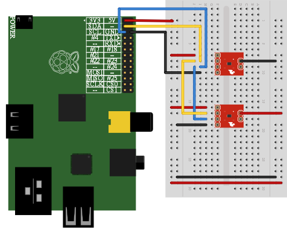
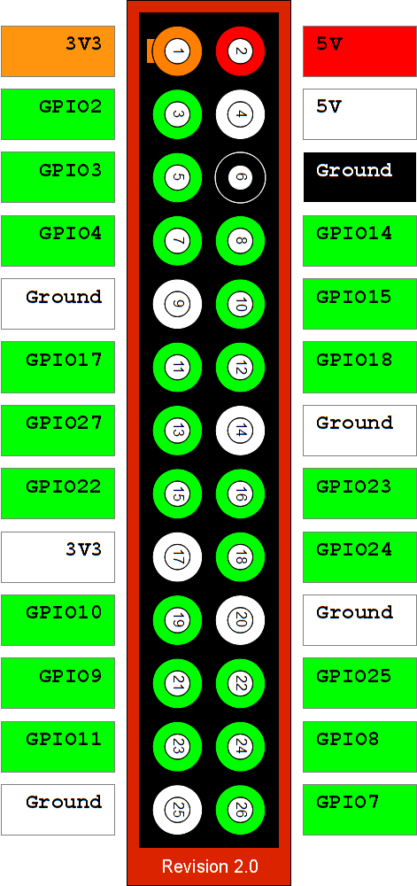

Setup information for the project:
==================================

I am using two tpm102 sensors for measuring temperature, you can find more info [here](https://www.sparkfun.com/datasheets/Sensors/Temperature/tmp102.pdf)
Here is a picture how to connect them.

The motion sensor  which has three wires (+ | alarm | -) should be connected to 5v (GPIO 2 see below), ground different from the one used for the tmp102 (different than GPIO 6), so I use GPIO 26, and the alarm should be connected to GPIO 8.
When I say GPIO 8 I mean the number in the circle.

Software dependencies:
======================
...
